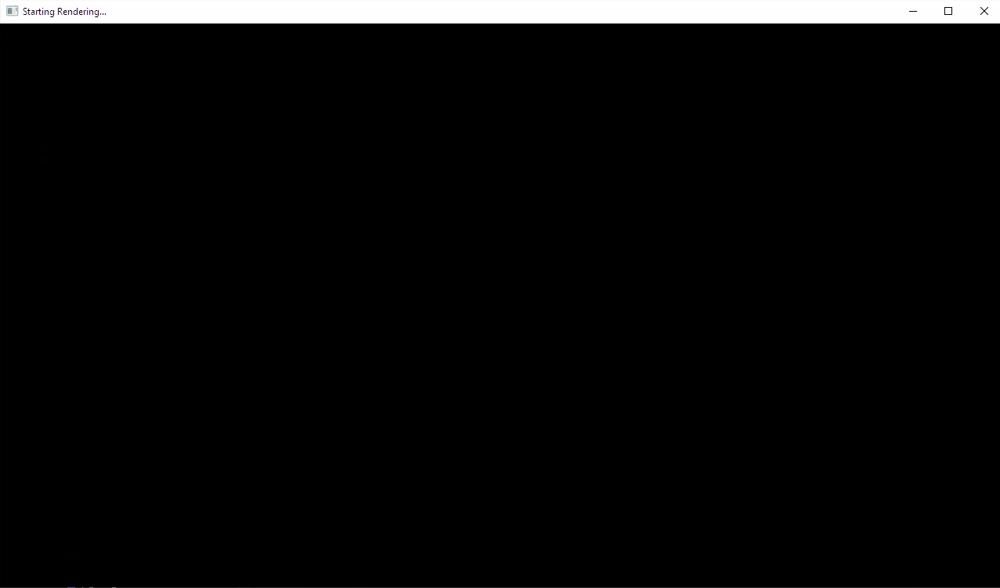

# ATRay
 >A raytracer written from scratch.
### Submodules: 
 - [PL](https://github.com/AdhavanT/PL) - Platform Layer for application
 - [ATP](https://github.com/AdhavanT/ATProfiler) - Profiling

### Features:
- Viewing rendering live,
- KD-Tree acceleration structure,
- Multithreading for rendering and model parsing 

## TODO:
- SIMD
- Materials
- Proper Scene definitions

## Demo

(Dragon - 139k faces, 416k verts)
